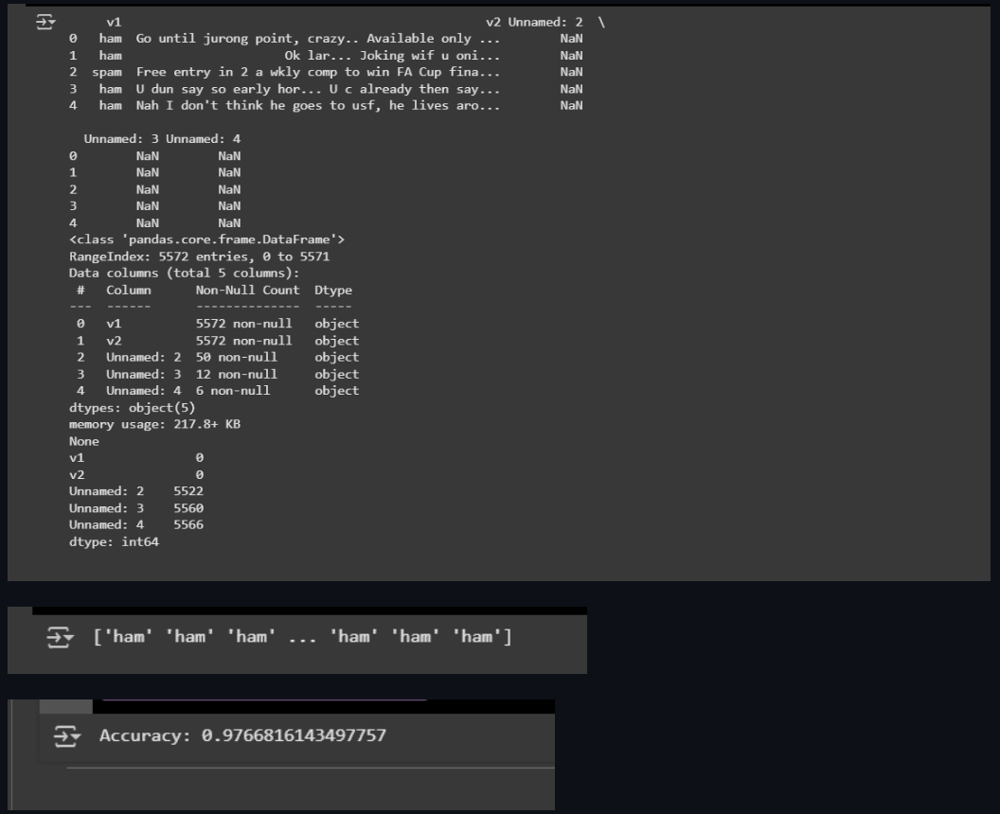

# Implementation-of-SVM-For-Spam-Mail-Detection

## AIM:
To write a program to implement the SVM For Spam Mail Detection.

## Equipments Required:
1. Hardware – PCs
2. Anaconda – Python 3.7 Installation / Jupyter notebook

## Algorithm
1. LOADING CSV FILES
2. SPLIT LABELS AND MESSAGES
3. TRAIN AND TESTS SPLIT
4. CONVERT TEXT TO NUM
5. TRAIN THE MODEL ANG MAKE GOOD PREDICTION
6. CHECKING ACCURACY 
## Program:
```
/*
Program to implement the SVM For Spam Mail Detection..
Developed by: PAUL SHERVIN P
RegisterNumber:  24901141
*/
```
```
data = pd.read_csv(io.BytesIO(uploaded['Spam.csv']), encoding='latin1')
data.head()
print(data.head())
print(data.info())
print(data.isnull().sum())
x = data["v2"].values  # messages
y = data["v1"].values  # labels
from sklearn.model_selection import train_test_split
x_train, x_test, y_train, y_test = train_test_split(x, y, test_size=0.2, random_state=0)
from sklearn.feature_extraction.text import CountVectorizer
cv = CountVectorizer()
x_train = cv.fit_transform(x_train)
x_test = cv.transform(x_test)
from sklearn.svm import SVC
svc = SVC()
svc.fit(x_train, y_train)
y_pred = svc.predict(x_test)
print(y_pred)
from sklearn import metrics
accuracy = metrics.accuracy_score(y_test, y_pred)
print("Accuracy:", accuracy)
```

## Output:


## Result:
Thus the program to implement the SVM For Spam Mail Detection is written and verified using python programming.
